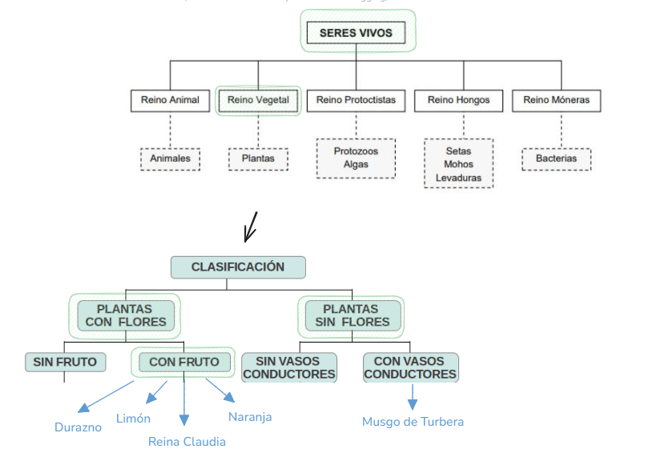

# Requerimientos del Programa

## Problema

> Necesitamos un sistema informático para la gestión del inventario de cosechas de un agricultor

> Imagen Referencial

## Requerimientos Específicos

> R01: El agricultor siembra distintos tipos de plantas como Durazno, Limón, Naranja y Reina Claudia.
> R02: El agricultor abona sus cultinos con musgo de TURBERA.
> R03: El Limón y la Naranja se pueden injertar
> R04: El Durazno y la Reina Claudia se pueden injertar
> R05: El la Reina Claudia y el limón se pueden injertar
> R06: La Naranja y el Durazno se pueden injertar
> R07: El agricultor registra su cosecha en el inventario
> R08: El cliente visualiza la cosecha en el inventario
> R09: El cliente retira la cosecha que no esta podrida
